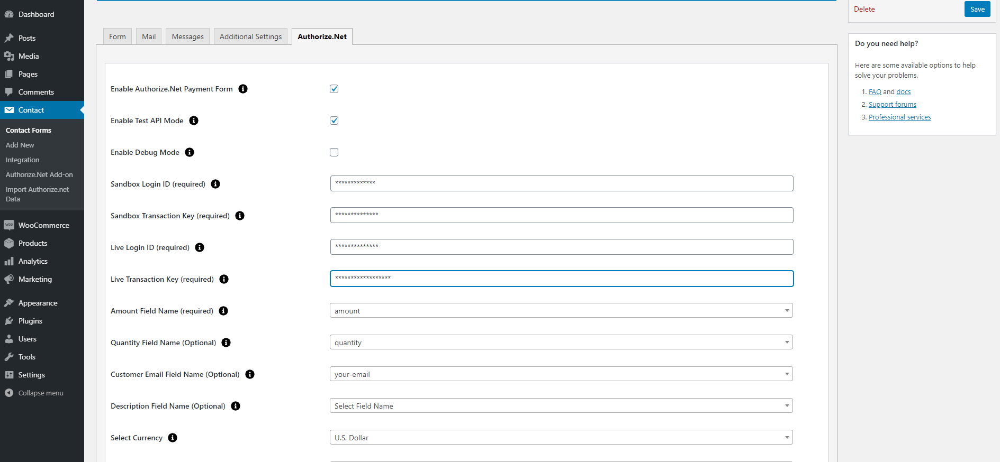
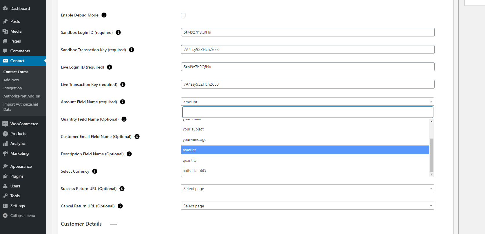
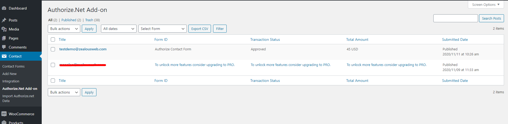
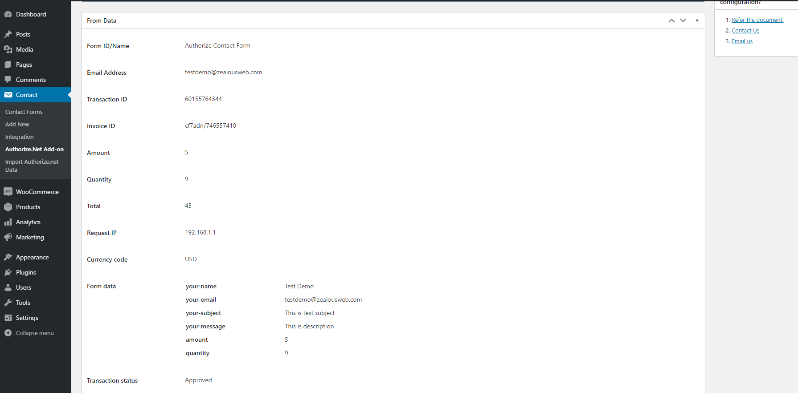
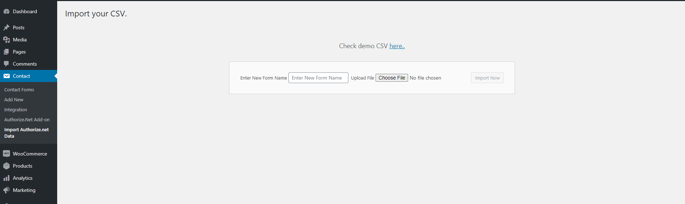

# Accept Authorize.NET Payments Using Contact Form 7
ZealousWeb Technologies has launched its ‘Accept Authorize.NET payment gateway using Contact Form 7 Pro’ plugin that integrates the payment gateway with Contact Form 7. This is ideal for users who face fee-related issues, helping them receive credit card payments directly from customers. Relying on this plugin prevents users from landing on a third-party payment page.
You can Create multiple payment forms using Contact Form 7.
Supports various formats on a single post or page.
You can enable Test API Mode to ensure the proper functioning of the payment transactions.
You can view Authorize.Net payment data details on the Admin side.

# Installation
1. Download the plugin zip file from WordPress.org plugin site to your desktop / PC
2. If the file is downloaded as a zip archive, extract the plugin folder to your desktop.
3. With your FTP program, upload the plugin folder to the wp-content/plugins folder in your WordPress directory online
4. Go to the Plugin screen and find the newly uploaded Plugin in the list.
5. Click ‘Activate Plugin’ to activate it.

# How To Use

You have to configure it from wp-admin > Contact > Add/Edit Contact Forms (Contact Form 7 needs to be activated before) to use this plugin.

You will find a new tab “Authorize.Net” along with Form, Mail, Messages, Additional Settings from where you can make all settings related to Authorize.Net.

Authorize.NET Amount Field Configuration

Authorize.NET Payment List Page

Authorize.NET Transaction Detail Page

Authorize.NET Import CSV Page

To add the Authorize.Net payment form to your Contact Form 7, find the setting attributes givenbelow.

- **Enable Authorize.Net Payment Form**
 Check the Authorize.Net Payment Form for Authorize submit button activation.
 
 - **Enable Test API Mode**
 Enable Test API Mode
 
  - **Enable Debug Mode**
 Check the Enable Debug Mode to start transaction debugging.
 
  - **Sandbox Login Id (required)**
 This field is required when you have set Authorize.net mode to sandbox if your site is in test mode.
 Get Your Sandbox Login ID:
 Get it from [Sandbox Authorize.net](https://sandbox.authorize.net/) then Account > Security Settings > API Credentials & Keys page in your Authorize.net account.
 
  - **Sandbox Transaction Key (required)**
 This field is required when you have set Authorize.net mode to sandbox if your site is in test mode.
 Get Your Sandbox Transaction Key:
 Get it from [Sandbox Authorize.net](https://sandbox.authorize.net/) then Account > Security Settings > API Credentials & Keys page in your Authorize.net account. For security reasons, you cannot view your Transaction Key, but you will be able to generate a new one.

  - **Live Login Id (required)**
 This field is required when you have set Authorize.net mode to live if your site is in live mode.
 Get Your Live Login ID:
Get it from [Authorize.net](https://www.authorize.net/) then Account > Security Settings > API Credentials & Keys
page in your Authorize.net account.

 - **Amount Field Name (required)**
 You have to set a name attribute to any of your fields of Contact Form 7 like drop-down menu, textbox, hidden field, radio buttons, etc., from which you need to pass the amount value to the Authorize.net website.
 For example, hidden price "20" This is a hidden field with the name “price”. You will need to set “price” in this Amount Field Name of Authorize tab.

- **Quantity Field Name (optional)**
 You have to set a name attribute to any of your field of Contact Form 7 like drop-down menu, textbox, hidden field, radio buttons, etc. from which you need to pass the quantity of the item to the Authorize.net website.
 
 For example, radio quantity "1" "2" "3" This is a radio button field with name “quantity”. You will need to set “quantity” in this Quantity Field Name of Authorize.net tab.
 
 - **Customer Email Field Name (optional)**
 You have to set a name attribute to the text field of contact form 7, from which you need to pass the customer’s custom email to the Authorize.net website.

 - **Description Field Name (optional)**
 You have to set a name attribute to the text field of Contact Form 7 from which you need to pass the description of the item to the Authorize.net website.
 
 - **Select Currency**
 You can select your currency of Authorize here, and there are 25 currencies supported in this plugin. Default is set as AUD (Australian Dollar).
 
 - **Success Return URL (optional)**
 You can enter the URL of the page to redirect for a Successful Authorize Payment transaction.
 
  - **Cancel Return URL (optional)**
 You can enter the URL of the page to redirect if a transaction fails.
 
   - **Customer Details**
 - **1.First Name**
  - You have to set a name attribute to the text field of contact form 7, from which you need to pass the First Name of the customer to the Authorize.net website. 

- **2.Last Name**
 - You have to set a name attribute to the text field of contact form 7, from which you need to pass the Last Name of the customer to the Authorize.net website.

- **3.Company Name**
 - You have to set a name attribute to the text field of contact form 7, from which you need to pass the Company Name of the customer to the Authorize.net website.

- **4.Address**
 - You have to set a name attribute to the text field of contact form 7, from which you need to pass the Address of the customer to the Authorize.net website.

- **5.City**
 - You have to set a name attribute to the text field of contact form 7, from which you need to pass the City of the customer to the Authorize.net website.

- **6.State**
 - You have to set a name attribute to the text field of contact form 7, from which you need to pass the State of the customer to the Authorize.net website.

- **7.Zip Code**
 - You have to set a name attribute to the text field of contact form 7, from which you need to pass the Zip Code of the customer to the Authorize.net website.

- **8.Country**
 - You have to set a name attribute to the text field of contact form 7, from which you need to pass the Country of the customer to the Authorize.net website.

# Getting Help

If you have any difficulties while using this Plugin, please feel free to contact us at opensource@zealousweb.com. We also offer custom WordPress extension development and WordPress theme design services to fulfill your e-commerce objectives. Our professional dy‐ namic WordPress experts provide profound and customer-oriented development of your project within short timeframes. Thank you for choosing a Plugin developed by ZealousWeb!
